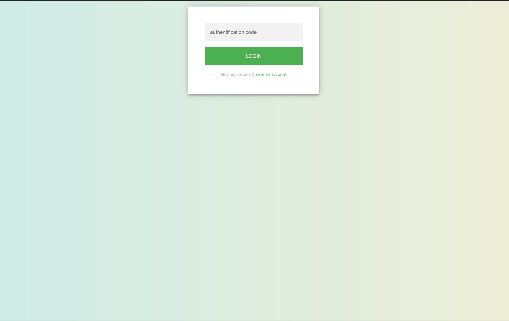
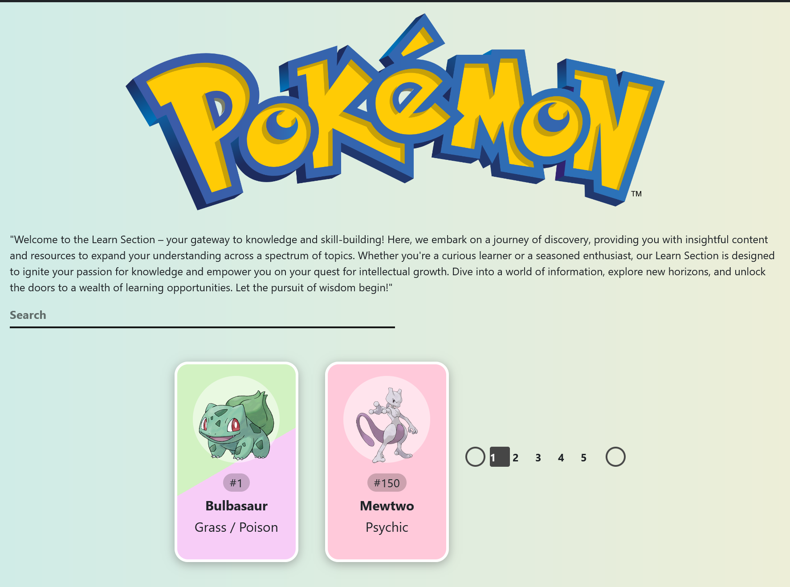
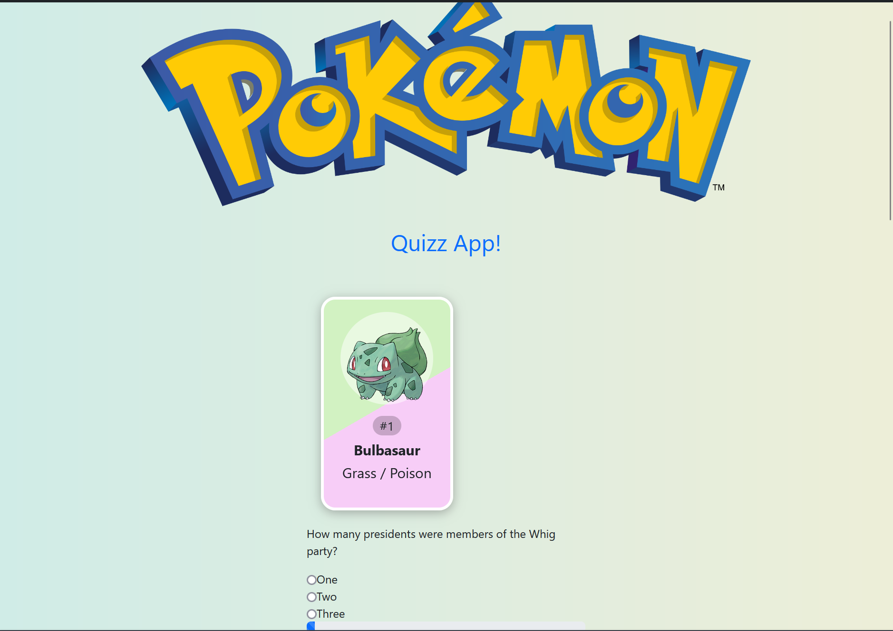
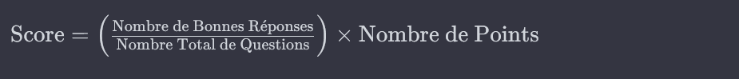
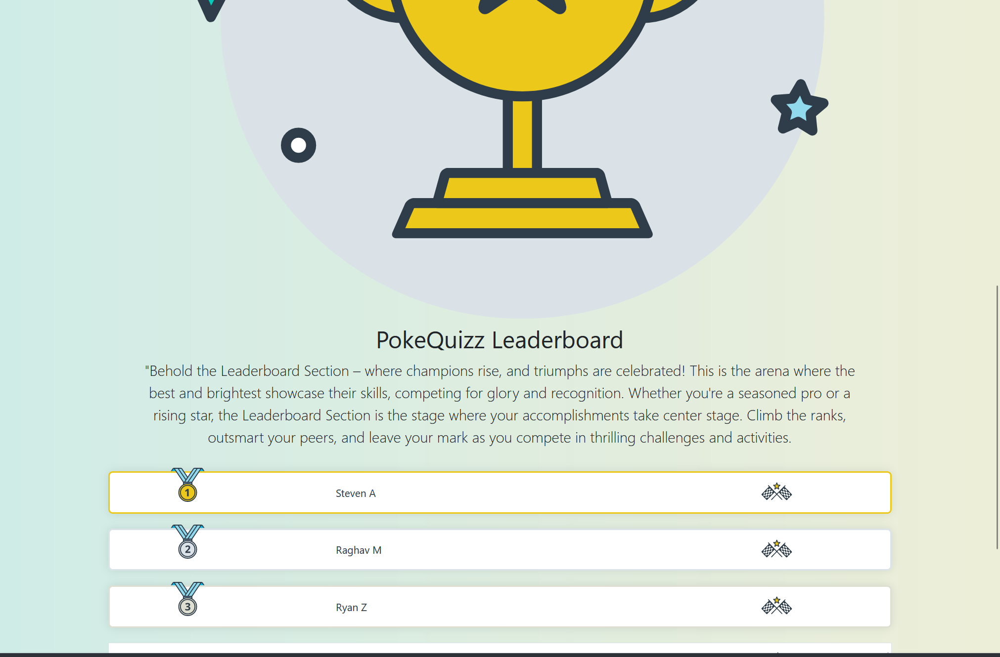
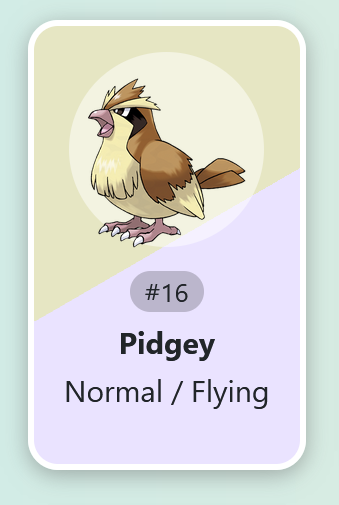

Dans ce challenge je vous propose de créer une application de quizz dans l'univers des pokemon en utilisant Reactjs et pokeAPi (https://pokeapi.co/docs) :

L'application est décomposée en 4 parties :

1. Système de Login par Code Généré Aléatoirement.
   

   - Les utilisateurs accèdent à l'application en entrant un code d'authentification généré aléatoirement.Le code est utilisé comme méthode d'authentification unique pour garantir l'accès aux utilisateurs autorisés..

   - Lles nouveaux utilisateurs peuvent créer un compte en fournissant un nom d'utilisateur (il doit être unique dans notre localStorage).

   - Après la création du compte, le code d'authentification est affiché à l'utilisateur pour la connexion ultérieure.

   - Accès Réservé aux Utilisateurs Authentifiés, l'application est accessible uniquement aux utilisateurs disposant d'un code d'authentification valide toutes les routes doivent être bloquées au final.

2. Moteur de Recherche de Pokémon avec Pagination (PokeAPI) :
    
    - Intégration d'un moteur de recherche permettant aux utilisateurs de trouver des Pokémon via l'API PokeAPI.
        
    - Mise en place d'un système de pagination pour une expérience fluide lors de la navigation dans les résultats de recherche.

3. Partie Quizz avec Affichage de 3 Pokémon Aléatoires :

    
    - Les utilisateurs participent à une partie de quizz avec l'affichage de trois Pokémon aléatoires. Ils doivent proposer le bon nom parmi les choix présentés, comprenant deux noms incorrects et un correct.

    Les utilisateurs répondent à 10 questions au total.
    Chaque bonne réponse rapporte 10 points. La limite de temps pour répondre à chaque question est paramétrable pour ajouter un élément de défi.

    La formule de calcul du score en fonction du pourcentage de bonnes réponses et d'un nombre de points peut être exprimée comme suit :
    
    

    Cette formule prend en compte le pourcentage de bonnes réponses par rapport au nombre total de questions posées. Elle multiplie ce pourcentage par le nombre de points attribués à chaque réponse correcte. Ainsi, le score final est une mesure de la performance relative de l'utilisateur, prenant en considération à la fois la précision des réponses et le nombre total de points possibles.

    > /!\ Éviter la Répétition de Pokémon dans le Quiz, les questions du quizz sont générées de manière à éviter la répétition des mêmes Pokémon au cours d'une session.

4.  Tableau de Bord des Scores :

    
    - Un tableau de bord affiche les scores des utilisateurs, mettant en avant les meilleurs joueurs, Les scores sont mis à jour en temps réel pour refléter les performances des joueurs le score se base sur le pourcentage de bonne réponse.


## Initialisation du Projet :

Utilisez le lien stackblitz pour récupérer les sources ou faire un fork du projet :
https://stackblitz.com/edit/stackblitz-starters-siqrcs?file=src%2Findex.tsx

Gestion de l'Authentification (Login.tsx) :

- Créez des actions Redux pour l'authentification (par exemple, authActions.js).
- Développez des composants React pour les formulaires de connexion et de création de compte.

## Utilisation du local storage :
```ts
// Stockage de données dans localStorage
localStorage.setItem('username', 'John');

// Récupération de données depuis localStorage
const username = localStorage.getItem('username');
console.log(username); // Sortie : John

// Mise à jour de données dans localStorage
localStorage.setItem('username', 'Jane');

// Suppression de données depuis localStorage
localStorage.removeItem('username');

// Suppression de toutes les données depuis localStorage
localStorage.clear();
```

> localStorage est limité au stockage de données sous forme de chaînes de caractères. Si vous souhaitez stocker des structures de données complexes comme des objets ou des tableaux, vous devrez les convertir en chaînes de caractères à l'aide de JSON.stringify() avant de les stocker, et les reconvertir à leur forme originale à l'aide de JSON.parse() lors de la récupération des données.

```ts
const user = { name: 'John', age: 30 };
localStorage.setItem('user', JSON.stringify(user));

const storedUser = JSON.parse(localStorage.getItem('user'));
console.log(storedUser); // Sortie : { name: 'John', age: 30 }
```

> bonus : vérifier si le nom de l'utilisateur n'est pas déjà utilisé avant de l'enregistrer

## Composant recherche de pokemon (Learn.tsx) :

- Intégrez l'api PokeAPI.
- Ajoutez un système de pagination sur cette page.
- Ajoutez un composant de details du pokemon avec des données additionnelles (utiliser une route avec un paramètre dynamique ex: pokemon/:id pour accéder à cette page). 
- Donnez la possibilité de faire des recherche sur cette page (bonus).

>  /!\ Voici un exemple de code en JavaScript utilisant la fonction fetch pour effectuer une requête POST et GET vers une API :
```ts
// POST request
 const response = await fetch('link_to_my_endpoint', {
  method: 'POST',
  headers: {
    'Content-Type': 'application/json'
  },
  body: JSON.stringify({ clé: 'valeur' })
});
const data = await response.json()

// GET request
 const response = await fetch('link_to_my_endpoint');
const data = await response.json()
```
Pour la pagination voir ici :
(GET) https://pokeapi.co/docs/v2#resource-listspagination-section

pour récupérer un pokemon en foonction de son id ou son nom :
(GET) https://pokeapi.co/api/v2/pokemon/{id or name}

pour récupérer les information d'un pokemon en fonction de son id:
(GET) https://pokeapi.co/api/v2/pokemon-species/{id}

## Créez du composant PokemonCard :



- pour récupérer les images des pokemons c'est par ici :
(GET) https://raw.githubusercontent.com/PokeAPI/sprites/master/sprites/pokemon/other/official-artwork/{id}.png

exemple : https://raw.githubusercontent.com/PokeAPI/sprites/master/sprites/pokemon/other/official-artwork/1.png
 

- Elle se retourne au survol changer le comportement pour la retourner lorsqu'on en a besoin
- si un pokemon a deux types faire un dégradé entre les couleur de chauqe type (bonus).
les couleur en fonction dy type de pokemon sont (vous avez la liberté d'en utiliser d'autres) :
```ts
const colors = {
	grass: "#d2f2c2",
	poison: "#f7cdf7",
	fire: "#ffd1b5",
	flying: "#eae3ff",
	water: "#c2f3ff",
	bug: "#e0e8a2",
	normal: "#e6e6c3",
	electric: "#fff1ba",
	ground: "#e0ccb1",
	fighting: "#fcada9",
	psychic: "#ffc9da",
	rock: "#f0e09c",
	fairy: "#ffdee5",
	steel: "#e6eaf0",
	ice: "#e8feff",
	ghost: "#dbbaff",
	dragon: "#c4bdff",
	dark: "#a9abb0"
};

```
- Remplacez appeler ce composant au endroits souhaités.

## Composant Quizz (Quizz.tsx) :

- Créez des actions Redux pour gérer les questions et les réponses dans le quizz.
  Utilisez un réducteur pour mettre à jour l'état global avec les réponses correctes et le score. Le score doit être enregistré dans le localStorage pour être sauvegardé.
- Gérez la gestion du temps de réponse de l'utilisateur.
- Comptabilisez et sauvegarder les résultats du quizz.

## Tableau de Bord des Scores avec Redux :

- Mettez en place un tableau de bord pour afficher les scores des utilisateurs.
- Utilisez Redux pour gérer l'état global des scores et les mises à jour en temps réel.
- Le classement affichera les 100 premiers utilisateurs du classement maximum.


 ## Navigation entre les Sections de l'Application :
 
 - Utilisez React Router pour gérer la navigation entre les différentes sections de l'application, les pages d'erreur (non autorisée 401 ou non trouvé 404) en utilisant le composant Error et le router.
 - ajoutez un menu en haut de la page avec les liens de navigation entre les pages, le nom de l'utilisateur avec son nombre de points et son classement actuel.

